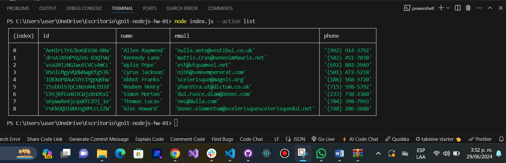
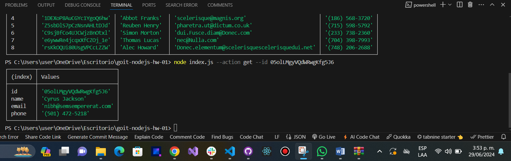
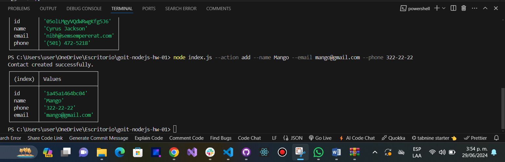
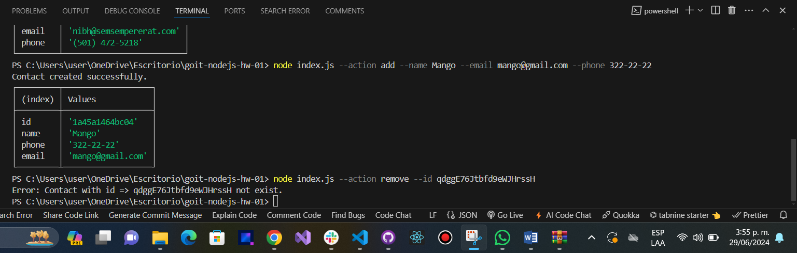

# Obtenemos y mostramos la lista completa de contactos en forma de tabla (console.table).

node index.js --action list

# Obtenemos un contacto según su id

node index.js --action get --id 05olLMgyVQdWRwgKfg5J6

# Añadimos un contacto

node index.js --action add --name Mango --email mango@gmail.com --phone 322-22-22

# Eliminamos un contacto

node index.js --action remove --id qdggE76Jtbfd9eWJHrssH

